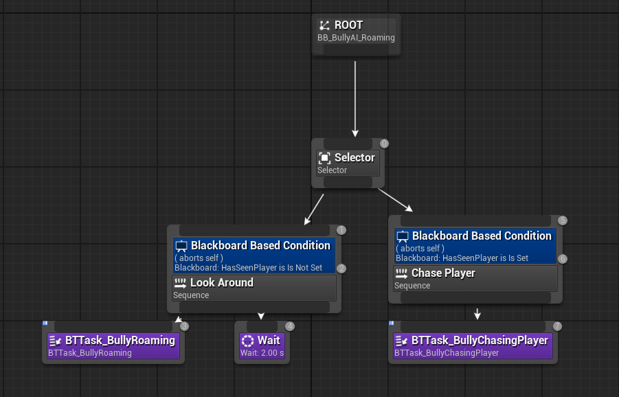
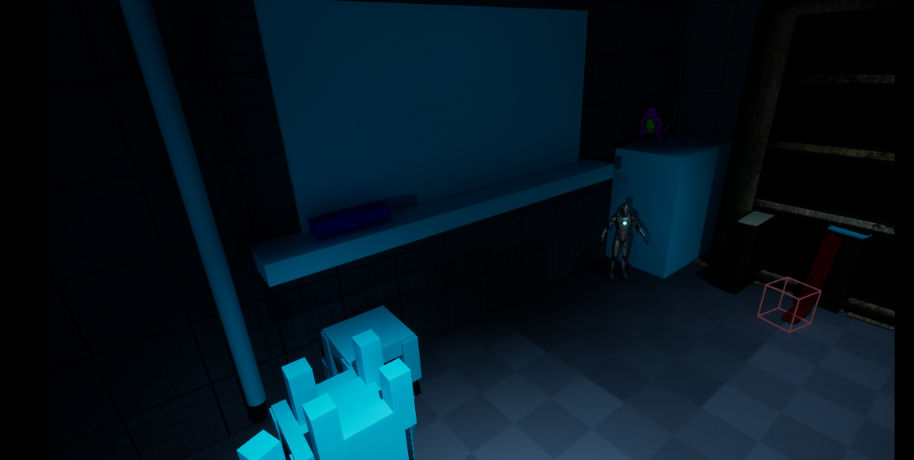
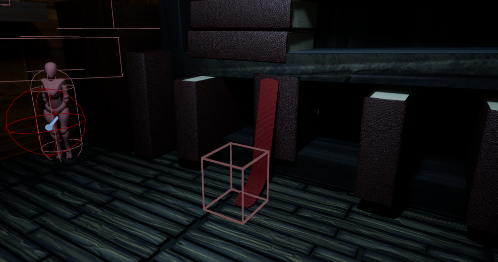
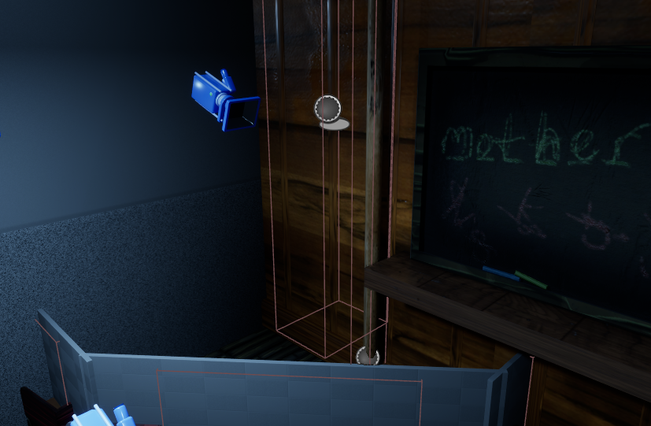

# 2326296 Liliana Bellas - Little Nightmares Project

Gameplay Design and Programming

FGCT4016

Weighting: 100%

## Brief

My Question I will be answering:

- Will video games inevitably mature into a new narrative artform driven by their storytelling ambitions? Consider different narrative structures deployed by game designers and the player’s role in experiencing and constructing game stories.  

## Project Outline 

 For this project I aim to create a near replica of a Little Nightmares II (LITTLE NIGHTMARES II | Official Website (EN), 2021) area that faithfully emulates and recreates the style, feel and gameplay of the source game. The core concept of the project is to have 3 main rooms in which the player progresses through, completing small physics based puzzles whilst fending themselves off from an array of enemies in order to solve the room's larger puzzle and ultimately break out ad escape the facility they are trapped in. The purpose of this project is to highlight my abilities as a developer to faithfully recreate gamestyles and present a workflow that would be industry standard whilst providing proof of my prowess as a developer to use in my personal portfolio. 

 The initial goals for this project are to faithfully recreate the feel and mechanics of Little Nightmares II due to its successes as a narrative horror that provides the player with an original and unique form of storytelling as they progress through the meticulously crafted world of Little Nightmares II. Little Nightmares II is one of the most successful in it's genre selling over 1 million copies in its first month on the market (Little Nightmares II reaches 1 million units sold! | Bandai Namco Europe, 2021) marking it as one of their highest grossing games. For reasons such as these, using Little Nightmares to base my project off and recreate their gameplay style and storytelling through environment would be one of my primary goals. Secondarily, I would like to be able to implement their fundamental mechanical systems faithfully.

 When it comes to the challenges I'll most likely face during my time developing the project, adjusting to working in Blueprints and Unreal in general will most likely be my biggest challenges. Given that Blueprints and Unreal are vastly different to enginges I have worked in before and languages I have programmed in, my biggest learning curve will be getting used to programming primarily in Blueprints and using C++ to support my blueprint work. Futhermore getting enemy AI to work as intended may provide a significant challenge. 

## Research 

### Methodology  

Going into the project, my main methodology for creating, designing and replicating the feel of little nightmares was to take a level from the base game that is as close in feel and setting to our desired project. In my case this is the school level from Little Nighmares 2. (Chapter 2: School- Complete Walkthrough - With Collectibles and Hats | Little Nightmares 2, 2021) I watched a video of the classroom level in its full to gain an idea for how I wanted to format the general mechanics, vibe and playstyle of the level. With my main takeaways from the watching session being that I wanted to create a more stealth based level that makes use of suspenseful moments and makes use of various elevations to play with perspective and scaling of the world around the character. To gain further insight I then researched and looked into an interview with Dave Mervik of Taiser Studios (Creating Little Nightmares, 2022) in which he goes into depth about the creation of Little Nightmares and its design philosophy. After reading the interview my main point was that they heavily valued was creating atmosphere and ensuring that the mood and feel of the level design matched the "Nightmare fuel-esq" art direction of Little Nightmares. This meant that having a blockout and mechanics that heavily reflected which I briefly mentioned in my project outline which was the stealth based gameplay and the heavy emphasis on precision platforming and physics based puzzles.

To ensure that the final project fulfils my vision, I will conduct user testing, gather feedback and then do repeat playtests with non team members to gain valuable criticisms and futher develop my project to be closer to an official Little Nightmares expansion.

### Game Sources  

Building further on my last segment, Little Nightmares and Little Nightmares 2 are my core game sources that I used to influence all my decisions and design choices when it comes to my own personal project. Scanning through a variety of interviews done by the Taiser Studios team I was able to gain a deeper understanding of how their game philosophy and design all pieced together to create a final project like Little Nightmares II. (Little Nightmares - Andreas Johnson & Dave Mervik Interview, 2016) Andreas Johnson focuses in on how background elements and subtle environmental details heavily contributes to how the overall story of Little Nightmares is percieved, this level of detail and interactivity contained within a story is something only achieveable in the media of games, highlighting specifically why it is so important to tell stories in this media and to allow them to be recognised as their own kind of artform. 

Furthermore, looking in on an interview for the upcoming Little Nightmares III (Little Nightmares III – Producer Interview | Bandai Namco Europe, 2023) that releases later this year talks about how Little Nightmares is a "unique style of horror, we call it charming horror" highlighting how Taiser Studios strives to create a different horror experience. I aim to achieve a similar kind of feeling with my own project, honing in on that unique horror aspect that is commonly exampled throughout the Little Nightmares series. 

### Academic Sources  

When analysing my approach from an academic standpoint, I turned to 'The Medium of Video Games' (The Medium of Video Games | Mark J.P. Wolf, 2001) to aid my understanding of what allows a vide game to trascend it's base inspirations of movie and boardgames to its own expansive art form. Turning to page 93, we understand that as graphics and technology evolved, so did the stories that were told throughout video game history. Mark notes that video games started as merely another form of entertainment, arcaic in nature and simplistic in execution. Though looking to the modern day, games like The Last of Us are pushing expectations of what it means to be a video game, using its narrative and storytelling to surpass the quality of many movies at the time, quickly raising to the top of charts and dominate the space. 

### Documentation Sources  
When starting on my project I knew going in that I would need to do a fair amount of research to further my ability to create efficent and functioning blueprints. As this was my first time working within Unreal Engine the support would be necessary. Using Gorka Games' AI video (The Easiest Way to Make a Simple Enemy AI in Unreal Engine 5, 2022) and Smart Poly's (How To Make Squid Game in Unreal Engine 5.5 (Tutorial), 2025) I was able to efficently understand how to create enemy AI that was simultaneously applicable to my very needs in my project but also flexible enough to widen my understanding if I needed to create further AI styles in my project. Alongside video tutorials, I also did deeper dives into Unreal Engine's documentation for blueprinting. I specifically knew that I was unfamilar with Unreal engine's UI systems and thus turned to (UI Widget Editor in Unreal Editor for Fortnite | Unreal Editor for Fortnite Documentation | Epic Developer Community, s.d.) such documentation to assist my ability to understand their widgeting and UI development in order to assist me in creating menus, options and so forth. 

## Implementation (Suggested Word Count 1,100)  

### Process

The project began by assigning everyone to their own seperate roles once we were sorted into our group. As the only developer of the group, my first action was to create a player controller and very basic fundamentals of the Little Nightmares II control scheme and mechanics in order to run in a sandbox environment. My first priority was to recreate the enemy sense and chase from Little Nightmares as that is the most prominent feature of the game. 

<iframe src="https://blueprintue.com/render/kkeho_pw/" scrolling="no" allowfullscreen></iframe>

*Figure 1. A blueprint of the enemy roaming code, showcasing the various functions the enemy is intended to have, like damaging player and sensing when the player is in range. Note that there are two versions of damaging the player, this was due to the first one not working as intended and thus a later fix was made.*

<iframe src="https://blueprintue.com/render/bd5726ct/" scrolling="no" allowfullscreen></iframe>

*Figure 2. A blueprint of the static enemy code, this was done as an alternative enemy type that would remain still until they spot the player rather than roaming around the level constantly, this doesn't utilise a blackboard unlike the roaming enemy which used a blackboard to assist with its roaming functionality.*

*Figure 3. A screenshot of the blackboard used for the enemy roaming AI*

With the initial two enemy AI types set up and working, the next course of action was to begin creating a level the player would actually be able to run around in and start implementing level based mechanics like the ability to grab boxes and climb ropes.

*Figure 4. A later in development screenshot showcasing a rope and a bookshelf in the back that would be interactable, this screenshot came much later than the blockout though showcases some of the core level mechanics I wanted to integrate*

Creating these level-based mechanics would further enhance the likeness when it came to comparing to the source material and thus set out to create a very basic ladder-like blueprint that would allow the player to scale it if they stood close. 

<iframe src="https://blueprintue.com/render/8ej8l1o2/" scrolling="no" allowfullscreen></iframe>

*Figure 5. My blueprint for the aforementioned ladder based level mechanic. Through a mix of variables and overlap checks, I was able to create a blueprint that checks whether or not the player is close enough to the ladder then turn on the variable that would set their movement mode to walk as they scaled the ladder. This method did eventually have its issues however it worked well enough for what I wanted it to do.*

<iframe src="https://blueprintue.com/render/hezda0ap/" scrolling="no" allowfullscreen></iframe>

*Figure 6. An additional blueprint highlighting some of the changes made to the default player input system to allow for the ladder blueprint to work, adjusting movement speeds and axis values to actually allow the player to scale any ladder or rope they were climbing up.*

<iframe src="https://blueprintue.com/render/31-a9-ik/" scrolling="no" allowfullscreen></iframe>

*Figure 7. My blueprint for the moveable boxes. In full honesty this blueprint is a mess and I can't really sugarcoat that. I attempted to create a system that, upon overlap with a collision box, the full object would attach to the actor, this then allowed the actor to continue to hold the button and move around the scene, this in theory did work and in execution also continued to work, though was not the most glamorous solution to the mechanic I was trying to solve. Though on later reflection I realised there were probably more elegant methods to doing this but hindsight is 2020*

*Figure 8. The moveable book in the final game*

*Figure 9. The climbable rope in the final game*

### New Approaches  
- Detail any innovative or new approaches you explored during the project.  
- Explain why these approaches were chosen and how they differ from standard practices.  
- Evaluate the success of these approaches, including any challenges faced and lessons learned.

### Testing
- Document the user testing conducted, specifying the type of tests used (e.g., automated testing, guided user testing, blind testing).  
- Present feedback or issues identified during testing, using graphs, tables, or visual aids to summarise results.  
- Describe how these issues were addressed. If any issues were not resolved, provide a clear justification for leaving them unaddressed.

### Technical Difficulties
- Identify any technical difficulties encountered during the implementation phase.  
- Provide details on how these issues were diagnosed and resolved.  
- If any difficulties remain unresolved, explain the impact on the project and any mitigation strategies used to minimise their effect.  
- Reflect on what you would do differently in future projects to avoid similar issues.

## Outcomes (Suggested Word Count 300) 

### Source Code/Project Files
- Provide a link to your complete source code or project files.  
- Ensure the link is publicly accessible or shared with the appropriate permissions.  
- Include a brief description of the files provided, highlighting key components or any instructions required to run the project.

### Build Link
- Share a link to a playable or executable build of your project.  
- Ensure the build is accessible across relevant platforms and is publicly accessible.  
- Include any necessary instructions for running the build, such as system requirements or installation steps.

### Video Demonstration
- Embed a video or provide a link to a recorded demonstration of your project in action.  
- The video should showcase key features, functionality, and any unique elements of your project.  
- Include a brief commentary or text overlay in the video to explain the different aspects of your project as they are shown.

## Reflection (Suggested Word Count 500) 

### Research Effectiveness  
- Assess the usefulness of the research conducted during the project.  
- Highlight which sources (games, academic, documentation) had the most significant impact on your work and explain why.  
- Identify any research gaps or areas where additional information could have improved your project outcomes.

### Positive Analysis 
- Reflect on the successful aspects of the project.  
- Highlight specific elements that worked well, such as technical solutions, creative decisions, or user feedback.  
- Provide evidence to support your analysis, such as test results, screenshots, or user comments.

### Negative Analysis  
- Identify the areas of the project that did not go as planned or could have been improved.  
- Discuss challenges you faced, whether technical, creative, or time-related, and evaluate their impact on the final product.  
- Reflect on any mistakes or missteps and what you learned from them.

### Next Time
- Outline what you would do differently if you were to undertake a similar project again.  
- Suggest improvements to your workflow, research methods, or implementation process based on your reflections.  
- Consider any new tools, techniques, or approaches you would explore in future projects to achieve better results.

## Bibliography  

(In order that they appear in this write-up)

LITTLE NIGHTMARES II | Official Website (EN) (2021) At: https://en.bandainamcoent.eu/little-nightmares/little-nightmares-ii (Accessed  07/03/2025).

Little Nightmares II reaches 1 million units sold! | Bandai Namco Europe (2021) At: https://en.bandainamcoent.eu/news/little-nightmares-ii-reaches-1-million-units-sold (Accessed  07/03/2025).

Chapter 2: School- Complete Walkthrough - With Collectibles and Hats | Little Nightmares 2 (2021) At: https://www.youtube.com/watch?v=QFRCDgjblis (Accessed  04/04/2025).

Creating Little Nightmares (2022) At: https://www.superjumpmagazine.com/creating-little-nightmares/ (Accessed  04/04/2025).

Little Nightmares - Andreas Johnson & Dave Mervik Interview (2016) At: https://www.youtube.com/watch?v=oouAM1kqc6s (Accessed  04/04/2025).

Little Nightmares III – Producer Interview | Bandai Namco Europe (2023) At: https://en.bandainamcoent.eu/little-nightmares/news/little-nightmares-iii-producer-interview (Accessed  04/04/2025).

Wolf, M. J. P. (2002) The Medium of the Video Game. (s.l.): University of Texas Press.

The Easiest Way to Make a Simple Enemy AI in Unreal Engine 5 (2022) At: https://www.youtube.com/watch?v=xm-7m5Fw1HU (Accessed  11/04/2025).

How To Make Squid Game in Unreal Engine 5.5 (Tutorial) (2025) At: https://www.youtube.com/watch?v=YIB3w2Ng-qQ (Accessed  11/04/2025).

UI Widget Editor in Unreal Editor for Fortnite | Unreal Editor for Fortnite Documentation | Epic Developer Community (s.d.) At: https://dev.epicgames.com/documentation/en-us/uefn/ui-widget-editor-in-unreal-editor-for-fortnite?application_version=1.0 (Accessed  11/04/2025).

## Declared Assets

