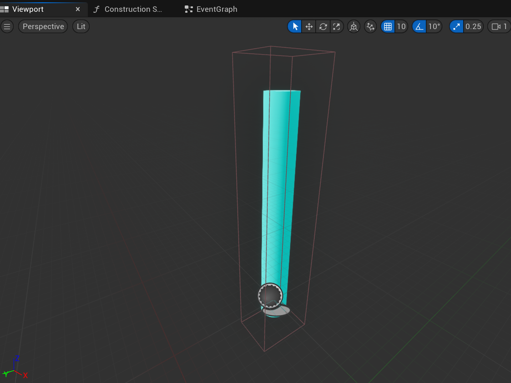
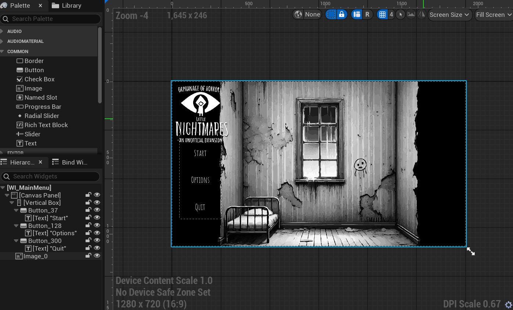
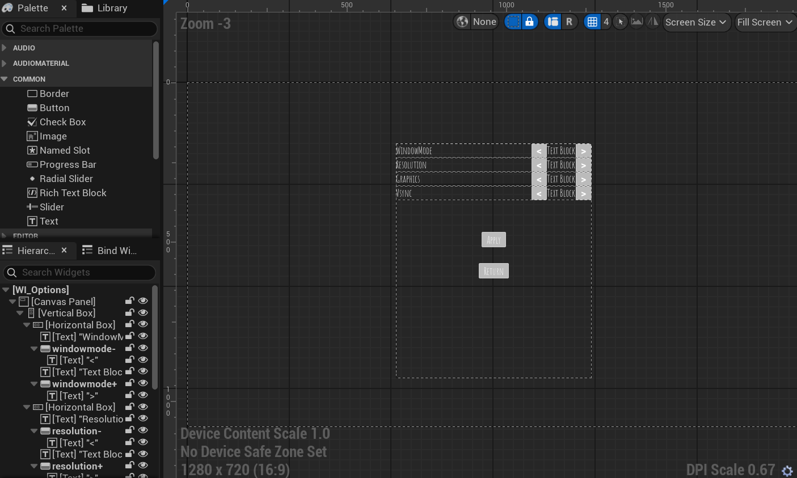

# 2326296 Liliana Bellas - Little Nightmares Project

Gameplay Design and Programming

FGCT4016

Weighting: 100%

## Brief

My Question I will be answering:

- Will video games inevitably mature into a new narrative artform driven by their storytelling ambitions? Consider different narrative structures deployed by game designers and the player’s role in experiencing and constructing game stories.  

## Project Outline 

 For this project I aim to create a near replica of a Little Nightmares II (LITTLE NIGHTMARES II | Official Website (EN), 2021) area that faithfully emulates and recreates the style, feel and gameplay of the source game. The core concept of the project is to have 3 main rooms in which the player progresses through, completing small physics based puzzles whilst fending themselves off from an array of enemies in order to solve the room's larger puzzle and ultimately break out ad escape the facility they are trapped in. The purpose of this project is to highlight my abilities as a developer to faithfully recreate gamestyles and present a workflow that would be industry standard whilst providing proof of my prowess as a developer to use in my personal portfolio. 

 The initial goals for this project are to faithfully recreate the feel and mechanics of Little Nightmares II due to its successes as a narrative horror that provides the player with an original and unique form of storytelling as they progress through the meticulously crafted world of Little Nightmares II. Little Nightmares II is one of the most successful in it's genre selling over 1 million copies in its first month on the market (Little Nightmares II reaches 1 million units sold! | Bandai Namco Europe, 2021) marking it as one of their highest grossing games. For reasons such as these, using Little Nightmares to base my project off and recreate their gameplay style and storytelling through environment would be one of my primary goals. Secondarily, I would like to be able to implement their fundamental mechanical systems faithfully.

 When it comes to the challenges I'll most likely face during my time developing the project, adjusting to working in Blueprints and Unreal in general will most likely be my biggest challenges. Given that Blueprints and Unreal are vastly different to enginges I have worked in before and languages I have programmed in, my biggest learning curve will be getting used to programming primarily in Blueprints and using C++ to support my blueprint work. Futhermore getting enemy AI to work as intended may provide a significant challenge. 

## Research 

### Methodology  

Going into the project, my main methodology for creating, designing and replicating the feel of little nightmares was to take a level from the base game that is as close in feel and setting to our desired project. In my case this is the school level from Little Nighmares 2. (Chapter 2: School- Complete Walkthrough - With Collectibles and Hats | Little Nightmares 2, 2021) I watched a video of the classroom level in its full to gain an idea for how I wanted to format the general mechanics, vibe and playstyle of the level. With my main takeaways from the watching session being that I wanted to create a more stealth based level that makes use of suspenseful moments and makes use of various elevations to play with perspective and scaling of the world around the character. To gain further insight I then researched and looked into an interview with Dave Mervik of Taiser Studios (Creating Little Nightmares, 2022) in which he goes into depth about the creation of Little Nightmares and its design philosophy. After reading the interview my main point was that they heavily valued was creating atmosphere and ensuring that the mood and feel of the level design matched the "Nightmare fuel-esq" art direction of Little Nightmares. This meant that having a blockout and mechanics that heavily reflected which I briefly mentioned in my project outline which was the stealth based gameplay and the heavy emphasis on precision platforming and physics based puzzles.

To ensure that the final project fulfils my vision, I will conduct user testing, gather feedback and then do repeat playtests with non team members to gain valuable criticisms and futher develop my project to be closer to an official Little Nightmares expansion.

### Game Sources  

Building further on my last segment, Little Nightmares and Little Nightmares 2 are my core game sources that I used to influence all my decisions and design choices when it comes to my own personal project. Scanning through a variety of interviews done by the Taiser Studios team I was able to gain a deeper understanding of how their game philosophy and design all pieced together to create a final project like Little Nightmares II. (Little Nightmares - Andreas Johnson & Dave Mervik Interview, 2016) Andreas Johnson focuses in on how background elements and subtle environmental details heavily contributes to how the overall story of Little Nightmares is percieved, this level of detail and interactivity contained within a story is something only achieveable in the media of games, highlighting specifically why it is so important to tell stories in this media and to allow them to be recognised as their own kind of artform. 

Furthermore, looking in on an interview for the upcoming Little Nightmares III (Little Nightmares III – Producer Interview | Bandai Namco Europe, 2023) that releases later this year talks about how Little Nightmares is a "unique style of horror, we call it charming horror" highlighting how Taiser Studios strives to create a different horror experience. I aim to achieve a similar kind of feeling with my own project, honing in on that unique horror aspect that is commonly exampled throughout the Little Nightmares series. 

### Academic Sources  

When analysing my approach from an academic standpoint, I turned to 'The Medium of Video Games' (The Medium of Video Games | Mark J.P. Wolf, 2001) to aid my understanding of what allows a vide game to trascend it's base inspirations of movie and boardgames to its own expansive art form. Turning to page 93, we understand that as graphics and technology evolved, so did the stories that were told throughout video game history. Mark notes that video games started as merely another form of entertainment, arcaic in nature and simplistic in execution. Though looking to the modern day, games like The Last of Us are pushing expectations of what it means to be a video game, using its narrative and storytelling to surpass the quality of many movies at the time, quickly raising to the top of charts and dominate the space. This environmental narrative approach that games like The Last of Us use would definitely be a core design concept I would be integrating into my project to further its ability to standalone as its own art form as opposed to it just being another piece of interactive media.

### Documentation Sources  
When starting on my project I knew going in that I would need to do a fair amount of research to further my ability to create efficent and functioning blueprints. As this was my first time working within Unreal Engine the support would be necessary. Using Gorka Games' AI video (The Easiest Way to Make a Simple Enemy AI in Unreal Engine 5, 2022) and Smart Poly's (How To Make Squid Game in Unreal Engine 5.5 (Tutorial), 2025) I was able to efficently understand how to create enemy AI that was simultaneously applicable to my very needs in my project but also flexible enough to widen my understanding if I needed to create further AI styles in my project. Alongside video tutorials, I also did deeper dives into Unreal Engine's documentation for blueprinting. I specifically knew that I was unfamilar with Unreal engine's UI systems and thus turned to (UI Widget Editor in Unreal Editor for Fortnite | Unreal Editor for Fortnite Documentation | Epic Developer Community, s.d.) such documentation to assist my ability to understand their widgeting and UI development in order to assist me in creating menus, options and so forth. 

## Implementation  

### Process

The project began by assigning everyone to their own seperate roles once we were sorted into our group. As the only developer of the group, my first action was to create a player controller and very basic fundamentals of the Little Nightmares II control scheme and mechanics in order to run in a sandbox environment. My first priority was to recreate the enemy sense and chase from Little Nightmares as that is the most prominent feature of the game. 

<iframe src="https://blueprintue.com/render/kkeho_pw/" scrolling="no" allowfullscreen></iframe>

*Figure 1. A blueprint of the enemy roaming code, showcasing the various functions the enemy is intended to have, like damaging player and sensing when the player is in range. Note that there are two versions of damaging the player, this was due to the first one not working as intended and thus a later fix was made.*

<iframe src="https://blueprintue.com/render/bd5726ct/" scrolling="no" allowfullscreen></iframe>

*Figure 2. A blueprint of the static enemy code, this was done as an alternative enemy type that would remain still until they spot the player rather than roaming around the level constantly, this doesn't utilise a blackboard unlike the roaming enemy which used a blackboard to assist with its roaming functionality.*

*Figure 3. A screenshot of the blackboard used for the enemy roaming AI*

With the initial two enemy AI types set up and working, the next course of action was to begin creating a level the player would actually be able to run around in and start implementing level based mechanics like the ability to grab boxes and climb ropes.

*Figure 4. A later in development screenshot showcasing a rope and a bookshelf in the back that would be interactable, this screenshot came much later than the blockout though showcases some of the core level mechanics I wanted to integrate*

Creating these level-based mechanics would further enhance the likeness when it came to comparing to the source material and thus set out to create a very basic ladder-like blueprint that would allow the player to scale it if they stood close. 

<iframe src="https://blueprintue.com/render/8ej8l1o2/" scrolling="no" allowfullscreen></iframe>

*Figure 5. My blueprint for the aforementioned ladder based level mechanic. Through a mix of variables and overlap checks, I was able to create a blueprint that checks whether or not the player is close enough to the ladder then turn on the variable that would set their movement mode to walk as they scaled the ladder. This method did eventually have its issues however it worked well enough for what I wanted it to do.*

<iframe src="https://blueprintue.com/render/hezda0ap/" scrolling="no" allowfullscreen></iframe>

*Figure 6. An additional blueprint highlighting some of the changes made to the default player input system to allow for the ladder blueprint to work, adjusting movement speeds and axis values to actually allow the player to scale any ladder or rope they were climbing up.*

<iframe src="https://blueprintue.com/render/31-a9-ik/" scrolling="no" allowfullscreen></iframe>

*Figure 7. My blueprint for the moveable boxes. In full honesty this blueprint is a mess and I can't really sugarcoat that. I attempted to create a system that, upon overlap with a collision box, the full object would attach to the actor, this then allowed the actor to continue to hold the button and move around the scene, this in theory did work and in execution also continued to work, though was not the most glamorous solution to the mechanic I was trying to solve. Though on later reflection I realised there were probably more elegant methods to doing this but hindsight is 2020*

*Figure 8. The moveable book in the final game*

*Figure 9. The climbable rope in the final game*

After testing and running both these mechanics within the game environment I quickly figured out that the rope mechanic could be a bit tough to angle properly so that the player was sent upwards. This was due to an issue with the hitbox I had placed on it, I quickly adjusted the collision box to allow the player to approach it from any angle and still climb it, this made it significantly easier to use in gameplay.

*Figure 10. The adjusted collision box for the rope obect*

My next step was to ensure that there was functioning menus, title screen and allowing the player to restart the level or return to the main menu if they so wished to avoid the player being softlocked. I planned to also integrate a few graphical options to allow the game to run on lower end pcs and provide some optimisation setting for users. I figured that providing these settings would allow the game to also be accessed by a bigger user base if I were to further develop it and market it and thus I worked on these settings.

*Figure 11. An image of the canvas for the opening menu for the game, displaying 3 options to the player.*

The menus were all created using Unreal's widget system to display a widget over the player viewport when loading into certain specific levels, this was how I approached the main menu and options screen.

<iframe src="https://blueprintue.com/render/_pfos5uw/" scrolling="no" allowfullscreen></iframe>

*Figure 12. Blueprints for the main menu functionality. As indicated by the commented text, each option here has its own functionality to open a seperate thing, with the start button specifically opening the level map that the game was built in. Originally the start button used By Name instead of By Reference. This was changed as By Name had issues when it came to building the project.*

*Figure 13. The options menu canvas screen, containing various options for the player to adjust*

<iframe src="https://blueprintue.com/render/3xfkfjtn/" scrolling="no" allowfullscreen></iframe>

*Figure 14. Blueprint for all the options on the option menu. This blueprint was extremely lengthy due to the fact that I wanted to allow the player to save, load, quit and retain the options they had previously set on previous play sessions. I opted to using Unreal's built in graphic scaling nodes for the graphical options and vsync options. Then approaching the resolution I had to manually input the screen sizes and assign them to various pins which would then be set by using a number in an index that was changed via pressing the left or right arrows next to the options.*

The final thing to implement from our initial blockout and concepting was the big boss enemy of the level. This would be 'The Mother' who would occupy the final room and turn around occasionally, killing the player if they were spotted.

<iframe src="https://blueprintue.com/render/6mlhon6x/" scrolling="no" allowfullscreen></iframe>

*Figure 15. Blueprint for the mother ai, this blueprint both had the mother rotate 180 degrees on a random interval of time within a set range, it would then scan for the player and check if it was within its pawn sensing and if so apply damage to the player, this loop would repeat indefinitely, never stopping. This was the final main mechanic I wanted in the game to fully solidify the stealth aspect of the game.*

<iframe src="https://blueprintue.com/render/e1ur_0l8/" scrolling="no" allowfullscreen></iframe>

*Figure 16. Blueprint for a scrapped mechanic. Early in concepting I wanted to allow for the mother to be killed in the final room by pushing an object onto her head, ultimately knocking her out and killing her before you exited the level. The blueprint you see is scraps of that mechanic, though ultimately due to time constraints I was unable to get this mechanic to work as intended or fully fuctional, so it was scrapped.*

And with those mechanics showcased, all that was left for me to do was to piece everything together and create a fully finished product. I added additional blueprints here and there to fix mechanics, add some functionality but the ones shown here were the large bulk of the unique mechanics I had created.

<iframe src="https://blueprintue.com/render/bb3oodd7/" scrolling="no" allowfullscreen></iframe>

*Figure 17. The full blueprint for the main character.*

<iframe src="https://blueprintue.com/render/dhfe30yn/" scrolling="no" allowfullscreen></iframe>

*Figure 18. The level blueprint*

### Testing

During week 6 of the project we conducted class wide user testing in order to gain feedback and posted a forum for playtesters to fill out to allow us to gain a greater insight on how to improve the project. These were the results we gained that ultimately allowed us to realise that people took issue with some of the layout being finnicky and a bit jank and other segments feeling a bit unfair or unfun in general that we later adjusted.

*Figure 19. Screenshot of the google forms results that were taken during week 6's testing phase when we had other groups playtest our prototype and provide feedback.*

### Technical Difficulties

As previously mentioned I had a few technical difficulties when it came to certain mechanics not working, specifically with certain things like Figure 12's start button not working when creating a shipping build of the game. The issue was being caused by using By Name instead of By Reference and thus was an easy fix. 

I also had issues when it came to Figure 16's scrapped mechanic. This one went unresolved and unfortunately had a larger impact on the storytelling aspect and the narrative we were trying to provide with the game, rather than giving the player the choice to just leave or to kill the mother then leave. This had to be scrapped as for some reason the detection would not work despite registering as it would 
during debugging.

On the whole though I did not encounter all too many technical difficulties as most issues just boiled down to my unfamiliarity with Unreal Engine as I was still learning the ropes of the engine.

## Outcomes 

### Source Code/Project Files

{Github Repository Link} : https://github.com/lunaviadev/definitelynotlittlenightmares

Contains all source code files + UPROJECT file. 

### Build Link
{Itch.io final build Link} : https://github.com/lunaviadev/definitelynotlittlenightmares

Contains a downloadble exe of the game.

### Video Demonstration

{Youtube Demonstration Link} : https://youtu.be/JHiohJnSq1Y?si=9JZdGX5W7jha1Ic8

Contains a 4 minute walkthrough of the game.

## Reflection 

### Research Effectiveness  
For me personally, the research served as a crucial point for determining the outcome of my project. Having taken prior time to research certain subjects such as the developer interviews and documentation of unreal engine I figured I would be able to make a much better, more polished user experience that was extremely faithful to the source material that I was trying to replicate.

Though I feel as if I could've spent more time researching into academic sources as I felt my academic studies went fairly underutilised. Despite the general benefit I initially saw with my previous academic research, the philosophies proposed did not ultimately benefit me much when it came to designing or creating my project, nor influencing my outcomes and thus I decided fairly early on that academic research was not necessary in comparison to my game and documentation research.

### Positive Analysis 

Looking back on the project having completed it, I would definitely say that the most successful aspects of the project were the uniqueness of the rooms and gameplay styles. Having more parkour and platforming focus in the first room, puzzle focus in the second room, then stealth focus in the final room, I felt I was able to accurately capture the three core fundamental styles of Little Nightmares gameplay and integrate it into the project to create something similar to the source material.

Working closely with my designer Goose also helped massively when it came to this project. Throughout the entire project he was incredibly cooperative and was able to cover for my weaknesses when working in Unreal engine, like setting up our camera systems and importing animations. Areas I was particularly unconfident in doing.

Futhermore, our initial playtest during week 6 served to be incredibly useful to tweaking gameplay elements. Finding out what people found frustrating, what they enjoyed and what they thought needed changing was incredibly useful to ultimately shaping a better project.

### Negative Analysis  
- Identify the areas of the project that did not go as planned or could have been improved.  
- Discuss challenges you faced, whether technical, creative, or time-related, and evaluate their impact on the final product.  
- Reflect on any mistakes or missteps and what you learned from them.

I think the biggest mistep of the project was definitely my ambition. Having the alloted time and a larger group, I wanted to strive to create something quite ambitious for what was expected of me and I think due to the sheer amount of mechanics, features and various other elements that I wanted to integrate I got a bit lost in the project and ended up overwhelming myself, burning myself out and ultimately causing myself a lot of stress. This definitely lead to the game overall not having as much polish as I would've liked it to as I was reaching the end of the project's alloted time and struggling to wrap it up and provide a complete package, which ended up with mechanics scrapped, ideas half baked and a generally less polished product than I intended to create.

### Next Time

The biggest takeaway for me would just to manage my mechanics and time more effectively. Creating a better work schedule for myself that better outlined what I wanted to achieve for any given session rather than just approaching a work session with the mentality of 'I'll get what I feel like getting done' and then ultimately hap-hazardly working on various features at once and bouncing between them would be a method I do not use again. I think structure for this would've benefitted me greatly.

## Bibliography  

(In order that they appear in this write-up)

LITTLE NIGHTMARES II | Official Website (EN) (2021) At: https://en.bandainamcoent.eu/little-nightmares/little-nightmares-ii (Accessed  07/03/2025).

Little Nightmares II reaches 1 million units sold! | Bandai Namco Europe (2021) At: https://en.bandainamcoent.eu/news/little-nightmares-ii-reaches-1-million-units-sold (Accessed  07/03/2025).

Chapter 2: School- Complete Walkthrough - With Collectibles and Hats | Little Nightmares 2 (2021) At: https://www.youtube.com/watch?v=QFRCDgjblis (Accessed  04/04/2025).

Creating Little Nightmares (2022) At: https://www.superjumpmagazine.com/creating-little-nightmares/ (Accessed  04/04/2025).

Little Nightmares - Andreas Johnson & Dave Mervik Interview (2016) At: https://www.youtube.com/watch?v=oouAM1kqc6s (Accessed  04/04/2025).

Little Nightmares III – Producer Interview | Bandai Namco Europe (2023) At: https://en.bandainamcoent.eu/little-nightmares/news/little-nightmares-iii-producer-interview (Accessed  04/04/2025).

Wolf, M. J. P. (2002) The Medium of the Video Game. (s.l.): University of Texas Press.

The Easiest Way to Make a Simple Enemy AI in Unreal Engine 5 (2022) At: https://www.youtube.com/watch?v=xm-7m5Fw1HU (Accessed  11/04/2025).

How To Make Squid Game in Unreal Engine 5.5 (Tutorial) (2025) At: https://www.youtube.com/watch?v=YIB3w2Ng-qQ (Accessed  11/04/2025).

UI Widget Editor in Unreal Editor for Fortnite | Unreal Editor for Fortnite Documentation | Epic Developer Community (s.d.) At: https://dev.epicgames.com/documentation/en-us/uefn/ui-widget-editor-in-unreal-editor-for-fortnite?application_version=1.0 (Accessed  11/04/2025).

## Declared Assets

Janitor Model Little Nightmares II - https://sketchfab.com/3d-models/janitor-little-nightmares-ee2cbfe4e90b45bc873a3516ca0a4550

All other assets and music seen in the final product were created by people who were working on the project.